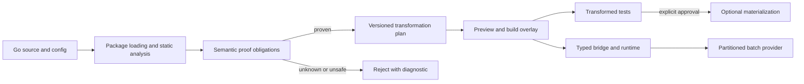

# BatchWeaver

[](https://github.com/Voskan/BatchWeaver/actions/workflows/ci.yml)
[](https://github.com/Voskan/BatchWeaver/actions/workflows/codeql.yml)
[](https://pkg.go.dev/github.com/Voskan/BatchWeaver)
[](LICENSE)

BatchWeaver is a proof-gated batching compiler and typed request-coalescing
runtime for Go. It finds supported scalar access patterns—including common N+1
query shapes—proves their safety conditions, previews deterministic changes,
and executes compatible calls in bounded batches without silently crossing
request, tenant, authorization, transaction, or session boundaries.

> **Release status:** `v0.1.0-beta.1` is selected but not published. There is
> currently no immutable tag, GitHub Release, or indexed pkg.go.dev version.
> The repository is suitable for evaluation, not a stable v1 claim. See the
> [release decision](docs/release/v1.0.0/stable-release-decision.md).

## Why BatchWeaver?

Hand-written batching can reduce backend round trips, but changing scalar code
can also change evaluation order, error identity, cancellation, deadlines,
result mapping, and isolation. BatchWeaver treats those behaviors as proof
obligations rather than implementation details.

- **Proof before transformation.** Unknown or unsupported behavior is rejected.
- **Overlay before mutation.** Scan, proof, plan, diff, build, and test can run
  without changing source files.
- **Typed library contracts.** Generic requests, outcomes, providers, and
  declarations avoid reflection in application-facing code.
- **Explicit isolation.** Scope and partition contracts keep incompatible work
  out of the same batch.
- **Fail-closed release tooling.** Checksums, SBOMs, provenance, compatibility,
  and publication gates are verified separately from publishing.
- **No hidden telemetry.** Workload profiles exclude raw keys, payloads,
  credentials, tenant identifiers, and source.

BatchWeaver does not promise that every Go call can be batched or that batching
always improves performance. Unsupported patterns remain scalar or are rejected
with a diagnostic.

## Install

Go 1.26.5 is the currently tested toolchain.

After an immutable beta tag is published, the CLI and library commands will be:

```bash
go install github.com/Voskan/BatchWeaver/cmd/batchweaver@v0.1.0-beta.1
go get github.com/Voskan/BatchWeaver@v0.1.0-beta.1
```

Those versioned commands intentionally do not work yet because no release tag
exists. For repository evaluation:

```bash
git clone https://github.com/Voskan/BatchWeaver.git
cd BatchWeaver
git switch release/v0.1.0-beta.1
make build
./bin/batchweaver version
./bin/batchweaver doctor
```

Go modules become discoverable on pkg.go.dev through the public Go module proxy
after a semantic-version tag is published and fetched. The exact publication
procedure and current blocker are documented in
[Using BatchWeaver as a Go module](docs/guides/use-as-go-module.md).

## Use the Go package

Declare a scalar function and its compatible batch provider with one typed,
statically discoverable value:

```go
package users

import (
    "context"

    batchweaver "github.com/Voskan/BatchWeaver"
    "github.com/Voskan/BatchWeaver/operation"
)

type User struct {
    ID   int
    Name string
}

func loadUser(ctx context.Context, id int) (User, error) {
    // Scalar implementation.
    return User{ID: id}, nil
}

func loadUsers(
    ctx context.Context,
    req batchweaver.BatchRequest[int],
) (batchweaver.BatchResponse[User], error) {
    values := make([]User, req.Len())
    for i, item := range req.Items() {
        values[i] = User{ID: item.Key}
    }
    return batchweaver.OrderedOutcomes(req, values)
}

var GetUser = batchweaver.MustDeclareFunction(
    operation.MustNewSpec(
        operation.MustParseID("users.get"),
        operation.ReadOnly(),
        operation.WithOrderedResults(),
        operation.WithRequestScope(),
    ),
    loadUser,
    loadUsers,
)
```

This declaration does not start goroutines, register global state, or mutate
source. The runtime API is opt-in; see the
[runtime guide](docs/guides/runtime-api.md) and the compile-tested
[declaration example](examples/declarations/basic).

## Five-minute workflow

```bash
# Inspect supported commands and validate configuration.
batchweaver help
batchweaver config validate --file examples/configuration/batchweaver.yaml

# Discover and prove candidates without modifying source.
batchweaver scan ./...
batchweaver prove ./...

# Review a deterministic plan and diff.
batchweaver transform plan ./...
batchweaver transform diff ./...

# Test transformed code through an overlay.
batchweaver test -- -race ./...
```

Materialization is a separate, explicit operation with backup, recovery, and
revert support. Start with the [verified batching tutorial](docs/tutorials/verified-batching.md).

## Architecture



The compiler is conservative: proof certificates are versioned, source anchors
are checked before use, transformed builds use overlays by default, and the
runtime validates provider outcomes before returning them to callers.

Read the [architecture overview](docs/architecture/overview.md),
[package boundaries](docs/architecture/package-boundaries.md), and
[safety model](docs/concepts/batching-model.md).

## What is implemented

- typed operation, request, response, partition, scheduling, retry, and fallback
  contracts;
- explicit request-scoped runtime coalescing with bounded queues, independent
  cancellation, deadlines, deduplication, memoization, and result validation;
- Go package loading, SSA, conservative call-graph/effect analysis, candidate
  discovery, and deterministic reports;
- semantic proof certificates and static loop-prefetch/runtime-lowering
  transformations through build overlays;
- narrow exact-key PostgreSQL read synthesis, `database/sql`, Redis mapping,
  explicit HTTP/OpenAPI batching, GraphQL wave analysis, and gRPC contracts;
- privacy-safe adaptive analysis, fairness, overload control, recursive waves,
  and bounded shadow/active tuning;
- standalone LSP, optional gopls proxy, workspace daemon, and VS Code extension;
- deterministic release archives, checksums, SPDX/CycloneDX SBOMs, local
  provenance, compatibility reports, and non-publishing release verification.

## Important limitations

- Concrete pgx, go-redis, gqlgen, and grpc-go client bindings are not included.
- SQL synthesis is limited to documented exact-key PostgreSQL reads; writes and
  arbitrary SQL rewrites are rejected.
- GraphQL/gRPC optimization requires explicit integrations; arbitrary network
  request fusion is not inferred.
- The current public API is prerelease and is not frozen as stable v1.
- Windows CI needs the current line-ending fix verified on a hosted runner.
- Dependency Review requires the repository Dependency Graph to be enabled.
- No release tag, public assets, Pages deployment, or pkg.go.dev version exists.

See [known issues](KNOWN-ISSUES.md) and the detailed
[limitations index](docs/README.md#limitations).

## Documentation

- [Documentation index](docs/README.md)
- [Tutorials](docs/tutorials/verified-batching.md)
- [How-to guides](docs/guides/scan.md)
- [Reference](docs/reference/configuration.md)
- [Architecture](docs/architecture/overview.md)
- [Compatibility](docs/release/compatibility.md)
- [Security](SECURITY.md)
- [Support](SUPPORT.md)
- [Contributing](CONTRIBUTING.md)

## Development

```bash
make fmt-check
go test ./...
go test -race ./...
go vet ./...
make check
```

Release assurance is non-publishing:

```bash
make release-snapshot
./bin/batchweaver release verify dist/release-manifest.json
```

## Project status

The stable-release evidence audit found no public prerelease, no release assets, no
external compatibility reports, and no verified adoption period. Stable
`v1.0.0` is therefore blocked even when local tests pass. The repository records
the exact evidence in [beta evidence](docs/release/v1.0.0/beta-evidence.md), the
[v1 gate report](docs/release/v1.0.0/stable-release-decision.md), and the
[continuation plan](docs/release/v1.0.0/project-completion.md).

## License

Apache License 2.0. See [LICENSE](LICENSE), [NOTICE](NOTICE), and
[THIRD_PARTY_NOTICES.md](THIRD_PARTY_NOTICES.md).
