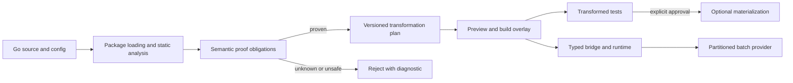

# BatchWeaver

[](https://github.com/Voskan/BatchWeaver/actions/workflows/ci.yml)
[](https://github.com/Voskan/BatchWeaver/actions/workflows/codeql.yml)
[](https://pkg.go.dev/github.com/Voskan/BatchWeaver@v1.0.0)
[](LICENSE)

BatchWeaver is a proof-gated batching compiler and typed request-coalescing
runtime for Go. It finds supported scalar access patterns—including common N+1
query shapes—proves their safety conditions, previews deterministic changes,
and executes compatible calls in bounded batches without silently crossing
request, tenant, authorization, transaction, or session boundaries.

> **Release status:** `v1.0.0` is the current stable release. The Tier 1 Go API
> is frozen under Semantic Versioning; `bridge` and the `adapters/*` packages
> are explicitly experimental, and compiler artifact schemas remain `v1alpha1`.
> Artifacts are checksummed and reproducible but **not signed**. See the
> [release notes](docs/release/release-notes-1.0.0.md), the
> [API freeze](docs/release/v1.0.0/api-freeze.md), and the
> [stable-release decision](docs/release/v1.0.0/stable-release-decision.md),
> which records the accepted risks this release ships with.

## Why BatchWeaver?

Hand-written batching can reduce backend round trips, but changing scalar code
can also change evaluation order, error identity, cancellation, deadlines,
result mapping, and isolation. BatchWeaver treats those behaviors as proof
obligations rather than implementation details.

- **Proof before transformation.** Unknown or unsupported behavior is rejected.
- **Overlay before mutation.** Scan, proof, plan, diff, build, and test can run
  without changing source files.
- **Typed library contracts.** Generic requests, outcomes, providers, and
  declarations avoid reflection in application-facing code.
- **Explicit isolation.** Scope and partition contracts keep incompatible work
  out of the same batch.
- **Fail-closed release tooling.** Checksums, SBOMs, provenance, compatibility,
  and publication gates are verified separately from publishing.
- **No hidden telemetry.** Workload profiles exclude raw keys, payloads,
  credentials, tenant identifiers, and source.

BatchWeaver does not promise that every Go call can be batched or that batching
always improves performance. Unsupported patterns remain scalar or are rejected
with a diagnostic.

## Install

Go 1.26.x is the tested support window: 1.26.0 is the minimum and 1.26.5 is the
current pinned release toolchain.

Install the CLI or add the typed library at the immutable beta version:

```bash
go install github.com/Voskan/BatchWeaver/cmd/batchweaver@v1.0.0
go get github.com/Voskan/BatchWeaver@v1.0.0
```

For a source checkout at the same version:

```bash
git clone https://github.com/Voskan/BatchWeaver.git
cd BatchWeaver
git checkout v1.0.0
make build
./bin/batchweaver version
./bin/batchweaver doctor
```

Package documentation and import examples are available through
[pkg.go.dev](https://pkg.go.dev/github.com/Voskan/BatchWeaver@v1.0.0). See
[Using BatchWeaver as a Go module](docs/guides/use-as-go-module.md) for the
library and CLI installation paths.

## Use the Go package

Declare a scalar function and its compatible batch provider with one typed,
statically discoverable value:

```go
package users

import (
    "context"

    batchweaver "github.com/Voskan/BatchWeaver"
    "github.com/Voskan/BatchWeaver/operation"
)

type User struct {
    ID   int
    Name string
}

func loadUser(ctx context.Context, id int) (User, error) {
    // Scalar implementation.
    return User{ID: id}, nil
}

func loadUsers(
    ctx context.Context,
    req batchweaver.BatchRequest[int],
) (batchweaver.BatchResponse[User], error) {
    values := make([]User, req.Len())
    for i, item := range req.Items() {
        values[i] = User{ID: item.Key}
    }
    return batchweaver.OrderedOutcomes(req, values)
}

var GetUser = batchweaver.MustDeclareFunction(
    operation.MustNewSpec(
        operation.MustParseID("users.get"),
        operation.ReadOnly(),
        operation.WithOrderedResults(),
        operation.WithRequestScope(),
    ),
    loadUser,
    loadUsers,
)
```

This declaration does not start goroutines, register global state, or mutate
source. The runtime API is opt-in; see the
[runtime guide](docs/guides/runtime-api.md) and the compile-tested
[declaration example](examples/declarations/basic).

## Five-minute workflow

```bash
# Inspect supported commands and validate configuration.
batchweaver help
batchweaver config validate --file examples/configuration/batchweaver.yaml

# Discover and prove candidates without modifying source.
batchweaver scan ./...
batchweaver prove ./...

# Review a deterministic plan and diff.
batchweaver transform plan ./...
batchweaver transform diff ./...

# Test transformed code through an overlay.
batchweaver test -- -race ./...
```

Materialization is a separate, explicit operation with backup, recovery, and
revert support. Start with the [verified batching tutorial](docs/tutorials/verified-batching.md).

## Architecture



The compiler is conservative: proof certificates are versioned, source anchors
are checked before use, transformed builds use overlays by default, and the
runtime validates provider outcomes before returning them to callers.

Read the [architecture overview](docs/architecture/overview.md),
[package boundaries](docs/architecture/package-boundaries.md), and
[safety model](docs/concepts/batching-model.md).

## What is implemented

- typed operation, request, response, partition, scheduling, retry, and fallback
  contracts;
- explicit request-scoped runtime coalescing with bounded queues, independent
  cancellation, deadlines, deduplication, memoization, and result validation;
- Go package loading, SSA, conservative call-graph/effect analysis, candidate
  discovery, and deterministic reports;
- semantic proof certificates and static loop-prefetch/runtime-lowering
  transformations through build overlays;
- exact/composite-key PostgreSQL read synthesis with bounded at-most-one joins,
  compile-checked SQL binding overlays, `database/sql`, Redis mapping,
  explicit HTTP/OpenAPI batching, GraphQL wave analysis, and gRPC contracts;
- typed pgx v5, go-redis v9, gqlgen, and grpc-go integration packages on the
  default branch, with pgxmock, miniredis, public-extension, and bufconn tests;
- privacy-safe adaptive analysis, fairness, overload control, recursive waves,
  and bounded shadow/active tuning;
- standalone LSP, optional gopls proxy, VS Code extension, and a secure
  workspace daemon with bounded shared analysis caching for CLI/editor requests;
- deterministic release archives, checksums, SPDX/CycloneDX SBOMs, local
  provenance, compatibility reports, and non-publishing release verification.

## Important limitations

- `bridge` and the four `adapters/*` client packages are experimental: they ship
  in the `v1` module but are not covered by the `v1` compatibility promise,
  because they track third-party client APIs.
- Release artifacts are checksummed, SBOM-documented, and reproducible, but they
  are **not cryptographically signed** and carry no hosted build attestation.
- Client integrations are covered by hermetic fakes, not by live PostgreSQL or
  Redis Cluster acceptance runs.
- SQL synthesis is limited to documented exact/composite-key PostgreSQL reads
  and one explicitly at-most-one INNER/LEFT join; writes, one-to-many joins, and
  arbitrary SQL rewrites are rejected.
- GraphQL/gRPC optimization requires explicit integrations; arbitrary network
  request fusion is not inferred.
- Compiler and runtime artifact schemas remain `v1alpha1`; they are regenerated
  rather than migrated and are excluded from the `v1` API promise.
- Linux, macOS, and Windows hosted builds pass on the corrected release branch.
- The VS Code extension is supplied as a GitHub Release VSIX, not through the
  Visual Studio Marketplace.
- Checksums are published, but the beta has no cryptographic tag or artifact
  signature; see the release notes and verification instructions.

See [known issues](KNOWN-ISSUES.md) and the detailed
[limitations index](docs/README.md#limitations).

## Documentation

- [Documentation website](https://voskan.github.io/BatchWeaver/docs.html)
- [Runnable examples](https://voskan.github.io/BatchWeaver/examples.html)
- [Go API and CLI](https://voskan.github.io/BatchWeaver/api.html)
- [Implemented features and v1 readiness](https://voskan.github.io/BatchWeaver/status.html)
- [Documentation index](docs/README.md)
- [Tutorials](docs/tutorials/verified-batching.md)
- [How-to guides](docs/guides/scan.md)
- [Reference](docs/reference/configuration.md)
- [Architecture](docs/architecture/overview.md)
- [Compatibility](docs/release/compatibility.md)
- [Security](SECURITY.md)
- [Support](SUPPORT.md)
- [Contributing](CONTRIBUTING.md)

## Development

```bash
make fmt-check
go test ./...
go test -race ./...
go vet ./...
make check
```

Release assurance is non-publishing:

```bash
make release-snapshot
./bin/batchweaver release verify dist/release-manifest.json
```

## Project status

`v1.0.0` freezes the Tier 1 public Go API under Semantic Versioning and ships a
tested upgrade path from every published prerelease. It ships with explicitly
accepted risks — unsigned artifacts, hosted compatibility evidence not observed
at the tagged commit, a short public prerelease period, and no live-backend
acceptance — each recorded with a remediation plan in the
[stable-release decision](docs/release/v1.0.0/stable-release-decision.md) and the
machine-readable [gate report](release/gates-v1.0.0.json).

The project does not claim long-term production-stability evidence. See
[beta evidence](docs/release/v1.0.0/beta-evidence.md) and the
[continuation plan](docs/release/v1.0.0/project-completion.md).

## License

Apache License 2.0. See [LICENSE](LICENSE), [NOTICE](NOTICE), and
[THIRD_PARTY_NOTICES.md](THIRD_PARTY_NOTICES.md).
