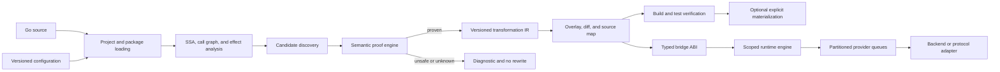
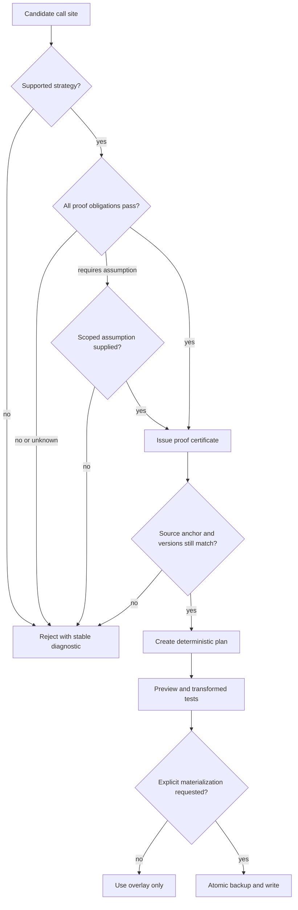

# Architecture Overview

BatchWeaver separates analysis, proof, transformation, execution, and
verification so that no stage can silently treat an optimization opportunity as
permission to change behavior. The implementation is conservative: an unknown
proof obligation rejects a transformation.

## End-to-end pipeline

## Safety decision flow

## Implemented subsystems

| Layer | Responsibility | Primary packages |
| --- | --- | --- |
| Public contracts | Requests, outcomes, declarations, operation policies | module root, `operation` |
| Configuration | Strict YAML/JSON loading, include/merge, validation, digest | `config`, `internal/config*` |
| Analysis | Package loading, SSA, call graph, effects, candidates | `internal/analysis` |
| Proof | Strategy obligations, witnesses, assumptions, certificates | `internal/proof` |
| Transformation | Plans, anchors, source maps, overlays, materialization | `internal/transform` |
| Runtime ABI | Typed generated bridge and barriers | `bridge` |
| Runtime | Scoped queues, scheduling, cancellation, validation, fallback | `runtime` |
| Adapters | SQL, Redis, HTTP/OpenAPI, GraphQL, gRPC contracts | `internal/adapter` |
| Adaptive | Profiles, bounded tuning, fairness, overload, waves | `internal/adaptive` |
| Editor | LSP, gopls proxy, unsaved overlays, daemon | `internal/lsp`, `internal/editor`, `internal/daemon` |
| Assurance | Differential, mutation, fault, soak, release verification | `internal/assurance`, `internal/release` |

## Dependency rules

Dependencies point from orchestration toward lower-level contracts. Public
packages never import CLI or compiler internals; the runtime never imports the
analysis or transformation engine; compiler implementation types remain under
`internal/`; and generated code targets only the versioned `bridge` ABI.

Repository architecture tests enforce key import boundaries. The
[package-boundary reference](package-boundaries.md) defines the supported import
surface.

## Runtime boundaries

Runtime coalescing is explicitly scoped. Queue compatibility includes operation,
scope, partition identity, provider binding, and scheduling policy. Tenant,
authorization, transaction, session, routing, and receiver identity are never
merged unless the declared contract proves that doing so is valid.

Provider calls return typed, per-request outcomes. Duplicate, missing, and
unexpected request IDs are validated before a result reaches application code.

## Versioned compatibility surfaces

Analysis reports, proof certificates, transformation plans, source maps,
generated bridges, adapter manifests, workload profiles, daemon messages, and
release manifests carry explicit schema or ABI versions. A mismatch invalidates
the artifact; it is not silently accepted.

## Deliberate limits

BatchWeaver supports documented transformation shapes and explicit providers.
It does not synthesize arbitrary writes, infer arbitrary network batching, or
claim universal performance improvement. See the [limitations index](../README.md#limitations).
