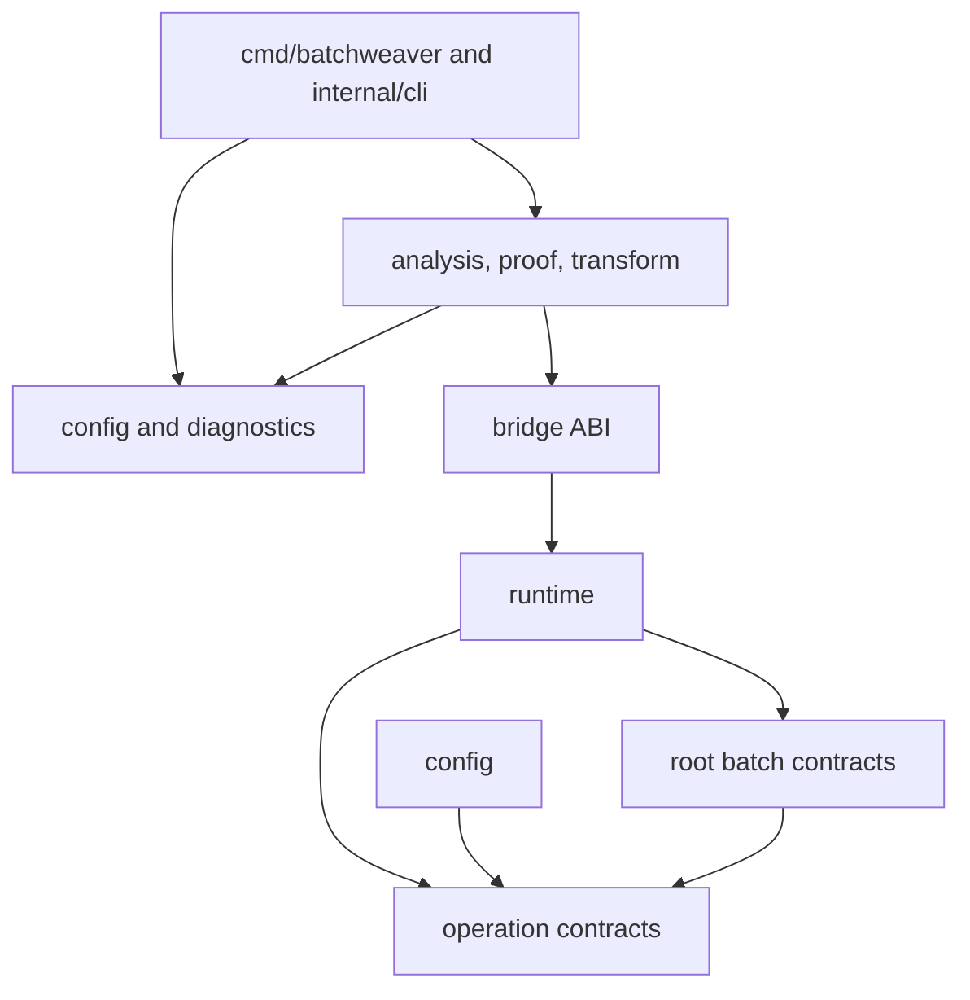

# Package Boundaries

The module exposes six importable public packages. Compiler and integration
implementations remain under Go's `internal` boundary so prerelease development
does not accidentally enlarge the supported API.

## Public packages

| Import path | Purpose | Prerelease stability |
| --- | --- | --- |
| `github.com/Voskan/BatchWeaver` | Generic batch requests, outcomes, helpers, and typed declarations | supported beta API |
| `github.com/Voskan/BatchWeaver/operation` | Operation identity, semantics, contracts, and policies | supported beta API |
| `github.com/Voskan/BatchWeaver/runtime` | Explicit scoped request coalescing | supported beta API |
| `github.com/Voskan/BatchWeaver/bridge` | Generated-code/runtime ABI | versioned alpha ABI |
| `github.com/Voskan/BatchWeaver/config` | Configuration loading and schema 1 | supported beta API |
| `github.com/Voskan/BatchWeaver/diagnostics` | Stable diagnostic data and formatters | supported beta API |

All six remain prerelease until an approved API-freeze decision and stable tag.
The exact exported surface is checked against
`internal/release/testdata/public-api.txt`.

## Internal packages

Packages below `internal/` implement the CLI, analysis, proof, transformation,
adapters, editor services, adaptive controller, and release tooling. External
modules cannot import them and no compatibility promise applies to their Go
identifiers.

Stable data emitted by an internal package is governed by its documented schema
version, not by the package's Go API. Examples include
`batchweaver.analysis/v1alpha1`, `batchweaver.proof/v1alpha1`, and
`batchweaver.transform/v1alpha1`.

## Dependency direction

Forbidden directions include runtime-to-compiler, public-package-to-CLI, and
public configuration containing AST, SSA, filesystem, or editor implementation
types.

## Review policy

Adding or changing an exported identifier requires tests, Go documentation,
the public API baseline, compatibility review, and migration notes when users
could be affected. Broad interfaces and generic utility packages are avoided.
